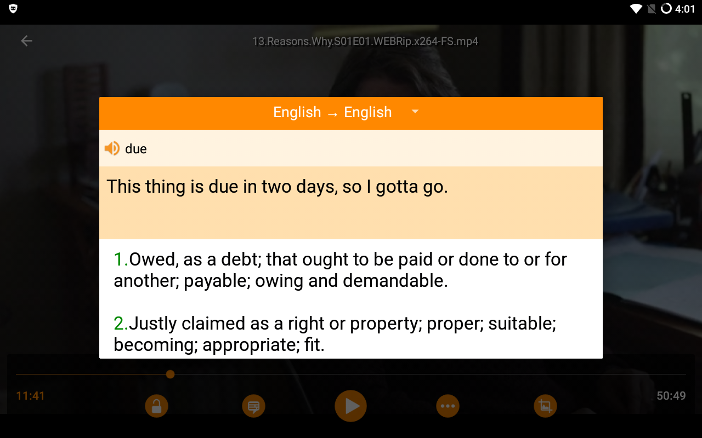

# Lingua Player
Powerful video and audio player with language learning feature.

#Overview
watch your favorite movie and learn a new language.

- Open Source, and based on VLC for Android
- Plays most video and audio files
- Shows the meaning of the words of the subtitle with touching them
- Full support Persian subtitle and other languages
- Sync subtitles with new method just by setting the sentence that should be shown
- Pop-up display
- Local network stream
- Change speed of playback
- Seek by 10s with double tap on screen edges
- Sync subtitle with classic method
- stream from a URL
- sync audio and video
- support multi language videos and change language
- control music player in notification bar

## Build
Build steps are same as VLC for Android.

You will need a recent Linux distribution to build VLC.
It should work with Windows 10, but no official support for this.
Check our [AndroidCompile wiki page](https://wiki.videolan.org/AndroidCompile/)

## Contribute
Contributions welcome!

